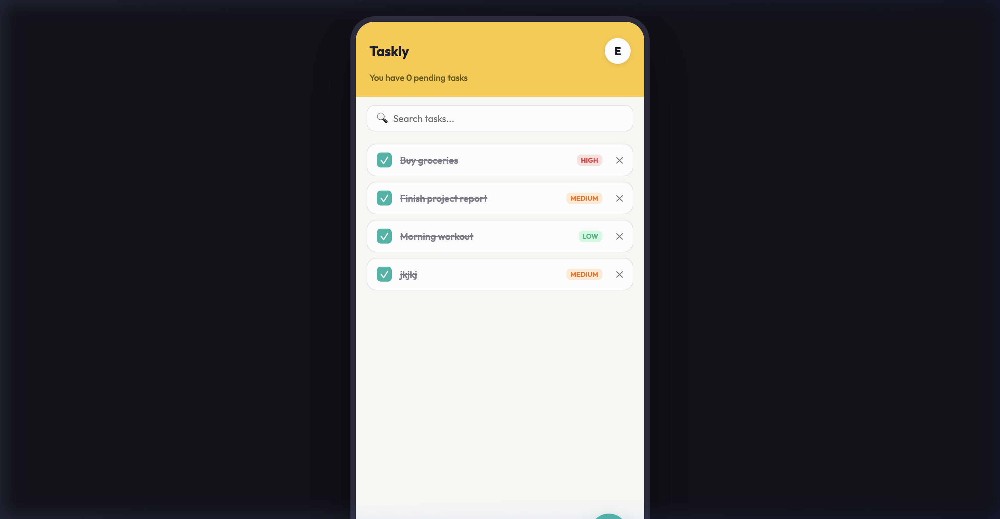
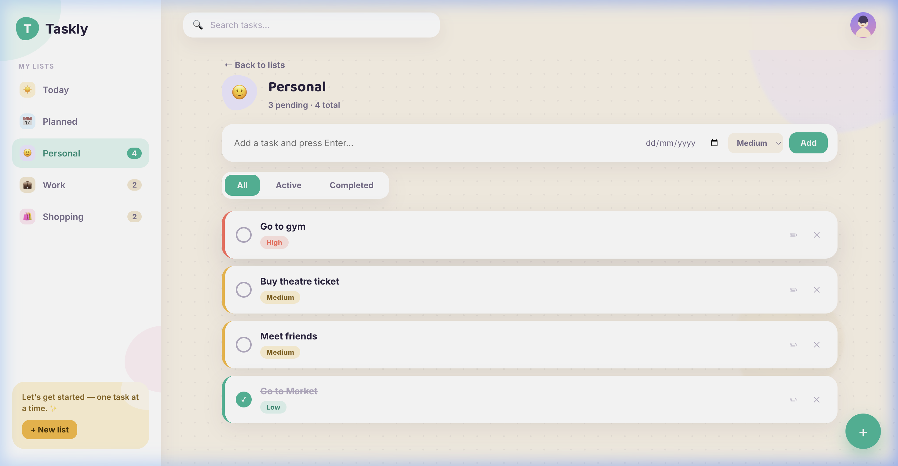
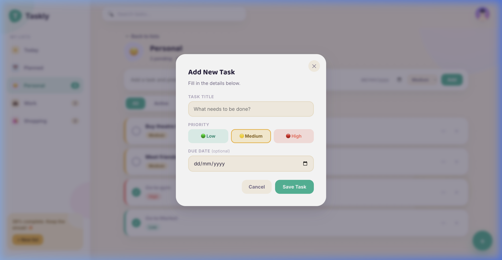
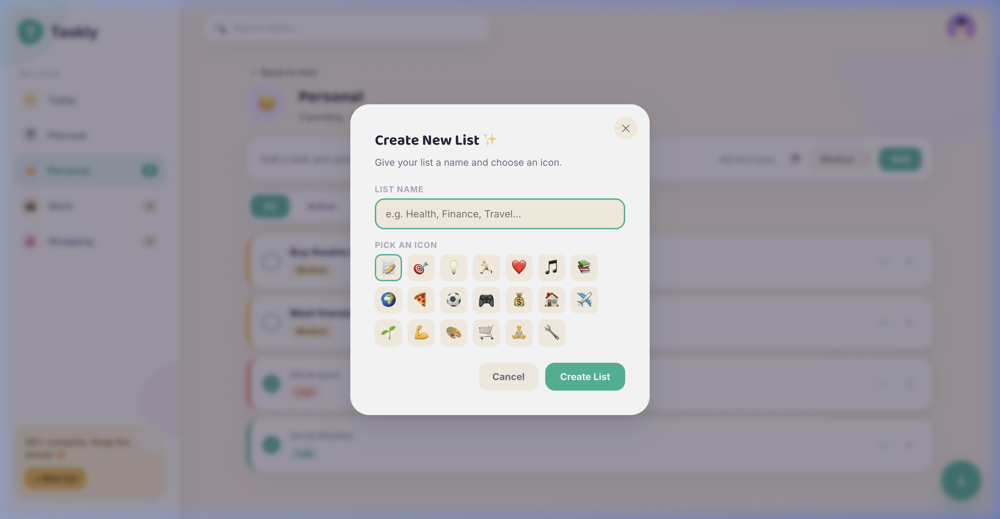

<div align="center">

# Taskly

### Advanced Task Manager — Python Desktop Application

[](https://python.org)
[](https://customtkinter.tomschimansky.com/)
[](LICENSE)
[]()

*A beautiful, dark-mode native desktop task manager built entirely in Python.*

</div>

---

## Screenshots

<table>
  <tr>
    <td align="center">
      
      <br><sub><b>Dashboard</b> — Smart lists & stats overview</sub>
    </td>
    <td align="center">
      
      <br><sub><b>Task List</b> — Priority-sorted task cards</sub>
    </td>
  </tr>
  <tr>
    <td align="center">
      
      <br><sub><b>New Task Modal</b> — Priority pills & due date</sub>
    </td>
    <td align="center">
      
      <br><sub><b>Create List Modal</b> — Custom emoji icon picker</sub>
    </td>
  </tr>
</table>

---

## Features

| Feature | Description |
|---|---|
| 🗂️ **Smart Lists** | Today, Planned, Personal, Work, Shopping — with custom list creation |
| 🚩 **Priority System** | High / Medium / Low with colour-coded pills and side-strips |
| 📅 **Due Dates** | Date entry with Today / Tomorrow quick presets, overdue highlighting in red |
| 🔍 **Live Search** | Real-time search across all tasks as you type |
| ✅ **Animated Checkboxes** | Smooth, native-feeling task completion toggle |
| 📊 **Stats Overview** | Total / Completed / Pending with a live progress bar |
| 🌙 **Dark Mode** | Premium deep-navy palette, HiDPI/Retina-sharp on all displays |
| 🗃️ **Filter Tabs** | All / Active / Completed views per category |
| 💾 **JSON Persistence** | Atomic write → tasks survive crash/quit with zero data loss |
| 🛡️ **Crash Recovery** | Corrupted JSON auto-backed up; app starts fresh instead of crashing |

---

## Tech Stack

| Layer | Technology |
|---|---|
| **GUI Framework** | [CustomTkinter 6.x](https://customtkinter.tomschimansky.com/) — modern, rounded, HiDPI-aware |
| **Backend / Logic** | Python standard library — `json`, `dataclasses`, `uuid`, `datetime` |
| **Data Model** | `@dataclass Task` with atomic JSON persistence |
| **Persistence** | Write-to-temp → `os.replace()` — crash-safe atomic saves |
| **Platform** | macOS · Windows · Linux (Python 3.9+) |

---

## Project Structure

```
taskly/
├── main.py                  # Entry point
├── run.sh                   # macOS/Linux launcher (auto-installs deps)
├── run.bat                  # Windows launcher
├── requirements.txt         # customtkinter + Pillow
│
├── app/
│   ├── __init__.py
│   ├── gui.py               # CustomTkinter UI — all screens + modals
│   ├── task_manager.py      # CRUD, persistence, search, validation
│   └── models.py            # Task @dataclass + PRIORITIES constants
│
├── data/
│   └── tasks.json           # Persistent storage (auto-created if missing)
│
├── screenshots/             # App screenshots for README / submission
├── design_mockup.html       # Original HTML design reference
└── index.html               # Web demo version (localStorage-based)
```

---

## Getting Started

### Prerequisites
- Python **3.9+** — [python.org/downloads](https://python.org/downloads)

### Run (macOS / Linux)

```bash
git clone https://github.com/mizhab-as/taskly.git
cd taskly

# Option A — auto-installer script (recommended)
./run.sh

# Option B — manual
pip install -r requirements.txt
python3 main.py
```

### Run (Windows)

```cmd
git clone https://github.com/mizhab-as/taskly.git
cd taskly
run.bat
```

> **Note**: `run.sh` / `run.bat` automatically run `pip install -r requirements.txt` before launching.

---

## Architecture

### Data Flow

```
User Action (GUI)
      │
      ▼
TasklyApp (gui.py)          ← CustomTkinter CTk root window
      │  calls
      ▼
TaskManager (task_manager.py)  ← Pure Python business logic
      │  mutates
      ▼
Task @dataclass (models.py)
      │  serializes to
      ▼
data/tasks.json             ← Atomic JSON persistence
```

### Key Design Decisions

**Atomic Saves** — Every mutation writes to `tasks.json.tmp` first, then `os.replace()` swaps it in. A crash mid-write never corrupts your data.

**Crash Recovery** — On startup, if `tasks.json` is malformed, it's backed up to `tasks.json.corrupt.bak` and the app starts fresh instead of raising an unhandled exception.

**Modular Architecture** — `TaskManager` has no knowledge of the GUI. It could power a CLI, Flask API, or Telegram bot without changes.

**CustomTkinter over plain Tkinter** — Delivers native-quality rounded corners, HiDPI rendering, and system dark-mode awareness that canvas-painting in Tkinter cannot replicate.

---

## Original Requirements — Fulfilled

| Requirement | Status | Implementation |
|---|---|---|
| Add a new task | ✅ | `TaskManager.add_task()` + New Task modal |
| Display all tasks | ✅ | Category detail view + search results |
| Mark a task as completed | ✅ | `TaskManager.toggle_task()` + animated checkbox |
| Delete a task | ✅ | `TaskManager.delete_task()` + confirm modal |
| Save tasks permanently (JSON) | ✅ | `TaskManager.save_tasks()` atomic write |
| Auto-load tasks on start | ✅ | `TaskManager.load_tasks()` in `__init__` |
| Exit safely | ✅ | All saves are immediate — no queued writes |

**Advanced additions beyond spec:**
- 🖥️ Full premium GUI (CustomTkinter, dark mode, HiDPI)
- 🗂️ 5 built-in lists + unlimited custom list creation
- 🚩 3-tier priority system with visual indicators
- 📅 Due dates with overdue highlighting
- 🔍 Live full-text search
- 📊 Stats overview card with progress bar
- 🗃️ All / Active / Completed filter tabs
- 🛡️ Full crash recovery + atomic persistence

---

## Development Roadmap

- [ ] **Phase 3** — Date-picker widget, sub-tasks, repeating tasks, keyboard shortcuts
- [ ] **Phase 4** — pytest suite, undo/redo, performance tests
- [ ] **Phase 5** — PyInstaller `.app`/`.exe` bundle, GitHub releases, app icon

---

## License

MIT — see [LICENSE](LICENSE)

---

<div align="center">
Built with ❤️ and Python · <a href="https://github.com/mizhab-as/taskly">github.com/mizhab-as/taskly</a>
</div>
