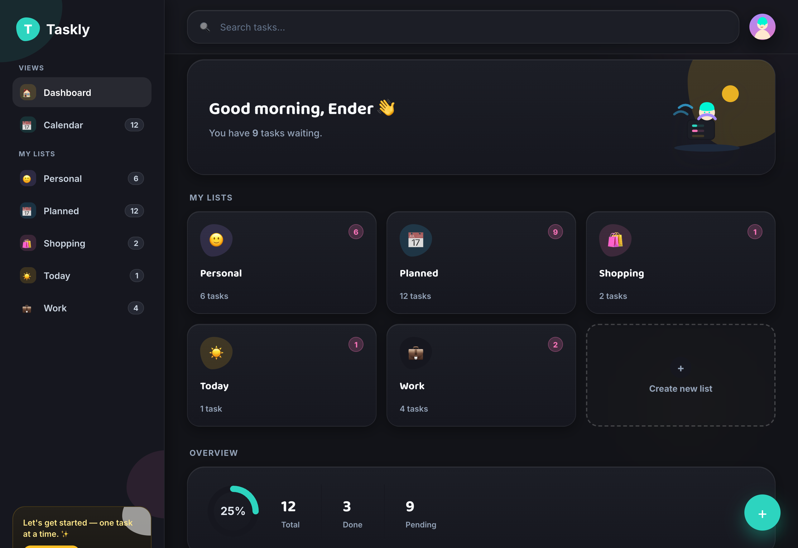
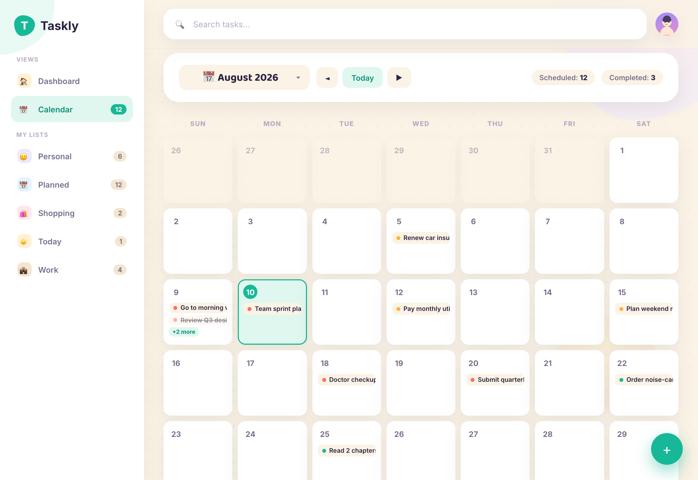
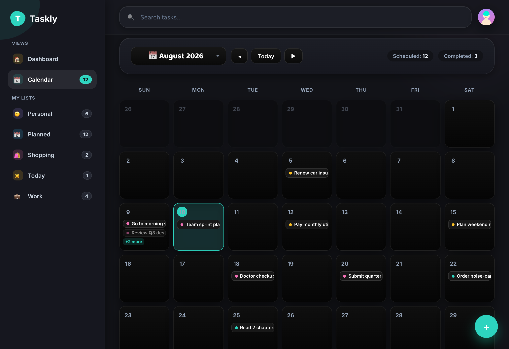
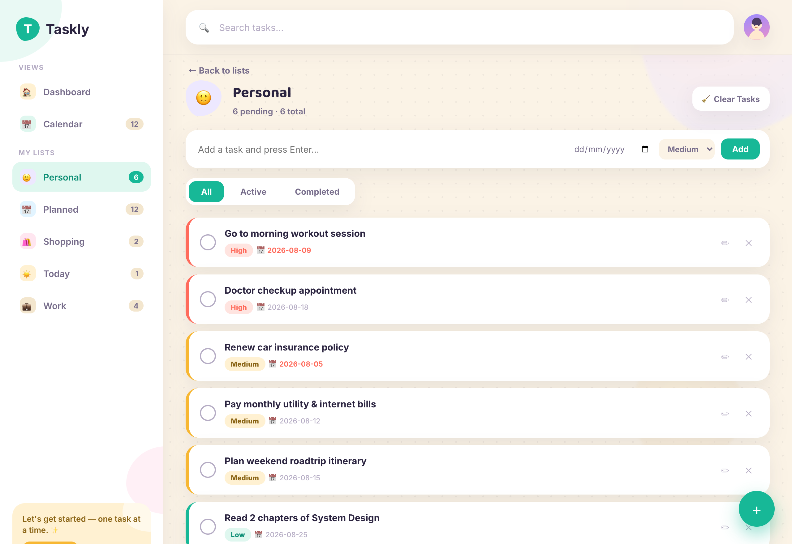
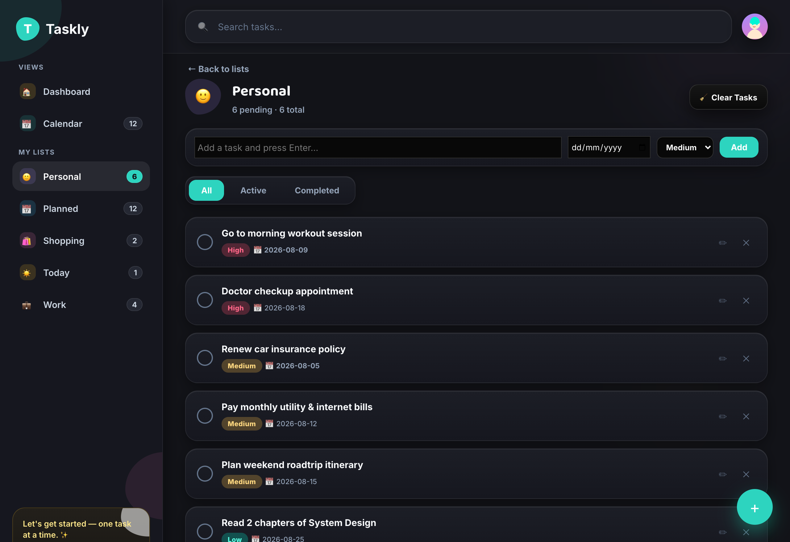
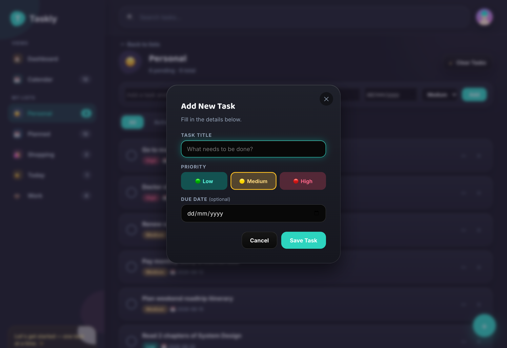
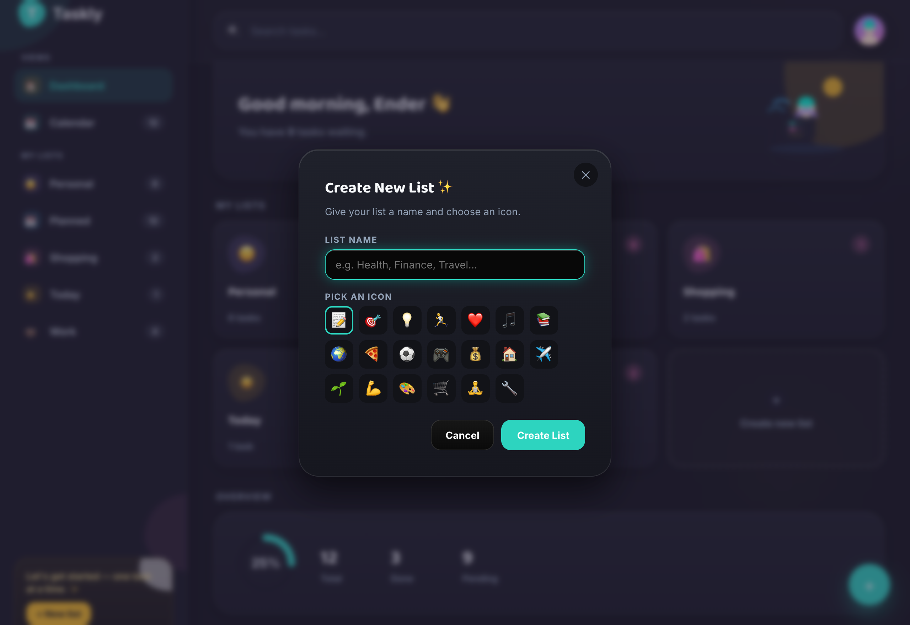
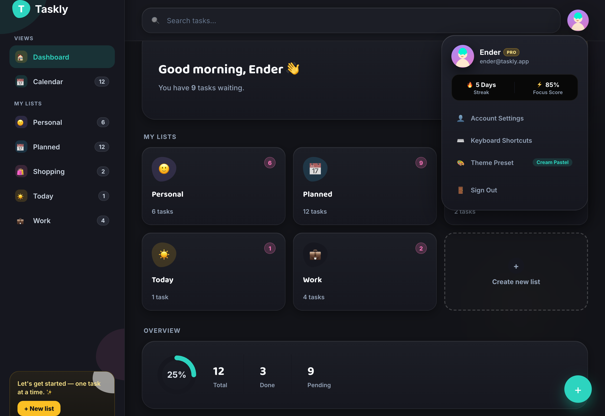
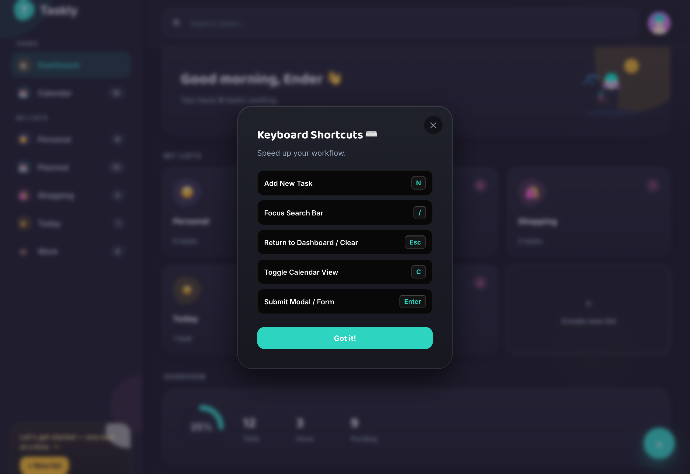

# ⚡ Taskly — Modern Task & Productivity Platform

[](LICENSE)
[](https://www.python.org/)
[](https://flask.palletsprojects.org/)
[](https://developer.mozilla.org/en-US/docs/Web/Progressive_web_apps)
[](https://vercel.com)
[](https://developer.android.com/)

**Taskly** is a high-performance, visually stunning, dual-mode productivity application built for managing tasks, lists, and schedules effortlessly across web, desktop, and mobile devices. Built with a responsive **Vanilla CSS** design system, **Eye-Comfort Obsidian Dark Theme**, uniform **Interactive Calendar View**, REST API backend, and **Android PWA & Native Capacitor APK** support.

---

## 📸 Dual-Theme Visual Showcase

| Light Theme ☀️ | Dark Theme 🌙 |
|---|---|
|  |  |
| *Hero greeting, progress ring chart, quick list access, and productivity statistics in Light Theme.* | *Obsidian Charcoal (#121318) Eye-Comfort Dark Theme for zero eye strain.* |

---

### 📅 1. Interactive Calendar View & Unlimited Year Stepper

| Calendar View (Light) | Calendar View (Dark) |
|---|---|
|  |  |

*Features strictly uniform 100% proportional day tiles, fixed-width navigation controls, and an infinite Month & Year picker modal.*

---

### 📋 2. Task List Management & Priority Sorting

| List Detail (Light) | List Detail (Dark) |
|---|---|
|  |  |

*Filter tasks by status (`All`, `Active`, `Completed`), sort by priority (`High`, `Medium`, `Low`), and track due dates with glowing status badges.*

---

### ➕ 3. Task Creation & Custom List Modals

| Add Task Modal | Create List Modal |
|---|---|
|  |  |

*Interactive modals for quick task insertion with priority pills and custom category list creation with color palettes and emoji icons.*

---

### 👤 4. Profile Popover & Hotkey Shortcuts

| Profile Popover | Keyboard Shortcuts |
|---|---|
|  |  |

*Track streak progress, toggle themes instantly, and access built-in hotkeys (`N` for new task, `C` for calendar, `/` for search).*

---

## ✨ Key Features

- 📱 **Dual Engine Architecture**: Automatically syncs with the Python Flask REST API backend when online, and seamlessly operates offline using `localStorage`.
- 🌓 **Dual Eye-Comfort Themes**: Toggle instantly between **Light Theme** (Warm Pastel Cream) and **Dark Theme** (Eye-Comfort Obsidian Charcoal `#121318`).
- 📅 **Uniform Calendar Grid**: Every day cell maintains strictly identical dimensions on desktop (`120px`) and mobile (`68px`) without row distortion.
- 📆 **Custom Month/Year Stepper Modal**: Infinite year navigation stepper (`◄ 2026 ►`) and a clean 3×4 month tile picker.
- 🔍 **Instant Live Search**: Perform real-time searches across all task titles and lists with highlighted matching terms.
- 📦 **Data Exporting**: Standalone CLI & API endpoints to download full task history in **JSON** or **CSV** formats.
- ⏰ **Background Reminders Daemon**: Background process that monitors overdue tasks and delivers desktop notifications.
- 📲 **Android App & PWA Ready**: Install natively on Android phones via PWA or build a native APK using Capacitor.
- ☁️ **Vercel Cloud Deployment**: Pre-configured `vercel.json` for 1-click cloud deployment.

---

## 🚀 Quick Start (Local Development)

### Run via Startup Script

Simply execute the launcher script:

```bash
./start.sh
```

This script automatically:
1. Installs Python dependencies (`Flask`, `flask-cors`, `gunicorn`).
2. Frees port `5050` if previously occupied.
3. Launches the Flask REST API server (`python/server.py`).
4. Starts the background reminder daemon (`python/reminders.py`).
5. Opens `http://localhost:5050` in your default browser.

---

## 📱 Android Phone Installation (PWA & APK)

Taskly supports **two simple methods** for running natively on Android devices:

### Method 1: Web PWA Installation (Instant — No Build Required)

1. Host or open Taskly in **Google Chrome** or **Microsoft Edge** on your Android device.
2. Tap the menu icon (`⋮`) in the top-right corner.
3. Select **"Install app"** or **"Add to Home screen"**.
4. Taskly will install as a standalone Android app with full app launcher icon, native splash screen, and offline support!

### Method 2: Native Android APK Build (Capacitor)

Taskly comes pre-configured with `capacitor.config.json`. To build an Android APK:

```bash
# 1. Install Capacitor CLI & Android package
npm install @capacitor/core @capacitor/cli @capacitor/android

# 2. Add Android platform
npx cap add android

# 3. Open project in Android Studio to build APK
npx cap open android
```

From Android Studio, click **Build > Build Bundle(s) / APK(s) > Build APK** to generate your `.apk` file for Android phones.

---

## ☁️ Vercel Deployment Guide

Taskly is pre-configured for 1-click deployment on **Vercel** via `vercel.json` using `@vercel/python`.

### Option A: Vercel CLI

```bash
# Install Vercel CLI
npm install -g vercel

# Deploy to Vercel
vercel
```

### Option B: GitHub Integration

1. Push this repository to GitHub.
2. Go to [Vercel Dashboard](https://vercel.com/new).
3. Import the repository — Vercel will automatically detect `vercel.json` and deploy your app instantly!

---

## 🛠️ REST API Reference

| Endpoint | Method | Description |
|---|---|---|
| `/api/health` | `GET` | Health check & server status |
| `/api/data` | `GET` | Fetch all task and list data |
| `/api/data` | `POST` | Save/update task and list database |
| `/api/export/json` | `GET` | Download timestamped JSON backup |
| `/api/export/csv` | `GET` | Download tasks formatted as CSV |
| `/api/overdue` | `GET` | Fetch uncompleted overdue tasks |

### CLI Data Export

Export data directly from the terminal:

```bash
python3 python/export.py          # Exports JSON & CSV to exports/
python3 python/export.py --json   # JSON only
python3 python/export.py --csv    # CSV only
```

---

## ⌨️ Keyboard Shortcuts

| Key | Action |
|---|---|
| <kbd>N</kbd> | Open Add Task Modal |
| <kbd>C</kbd> | Toggle Calendar View |
| <kbd>/</kbd> | Focus Live Search Bar |
| <kbd>Esc</kbd> | Return to Dashboard / Clear Search |
| <kbd>Enter</kbd> | Submit Form / Modal |

---

## 📁 Repository Structure

```
taskly/
├── frontend/                 # Web App Frontend (HTML5, Vanilla CSS, JS)
│   ├── index.html            # App Markup & Modals
│   ├── style.css             # Design System & Dual-Theme Styles
│   ├── app.js                # App Logic, State, Calendar & API Bridge
│   ├── manifest.json         # PWA Manifest Config
│   └── sw.js                 # PWA Service Worker
├── python/                   # Backend Python Scripts & Utilities
│   ├── server.py             # Python Flask REST API & Static File Server
│   ├── export.py             # CLI Data Export Utility
│   ├── reminders.py          # Background Desktop Reminder Daemon
│   └── take_screenshots.py   # Dual-Theme Automated Screenshot Generator
├── screenshots/              # 16 High-resolution dual-theme screenshots
├── releases/                 # Release packages & GitHub release notes
├── data/                     # Data persistence directory (tasks.json)
├── start.sh                  # Main executable launcher script
├── vercel.json               # Vercel deployment configuration
├── capacitor.config.json     # Capacitor Android configuration
└── requirements.txt          # Python dependencies
```

---

## 📄 License

This project is licensed under the **MIT License**. Feel free to modify and adapt for personal or commercial productivity projects!
