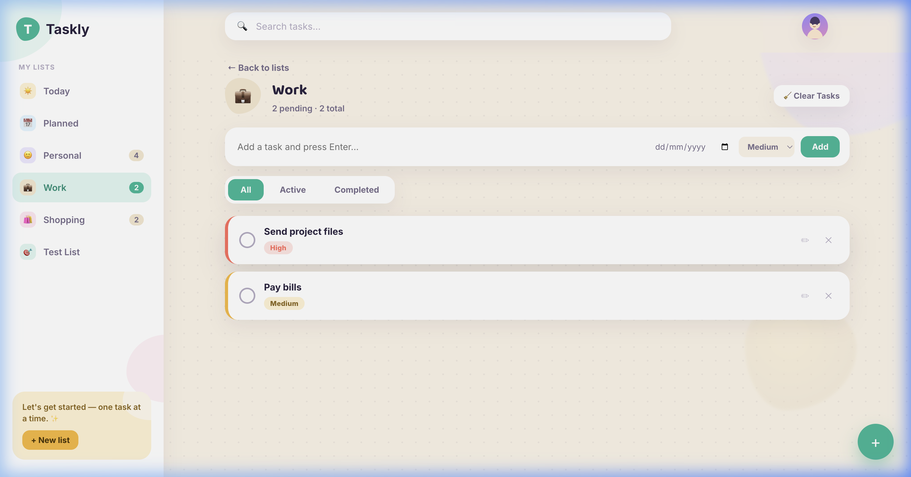
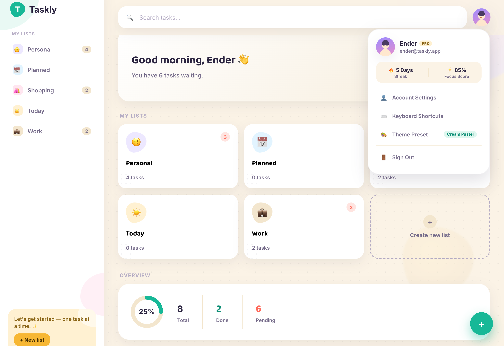
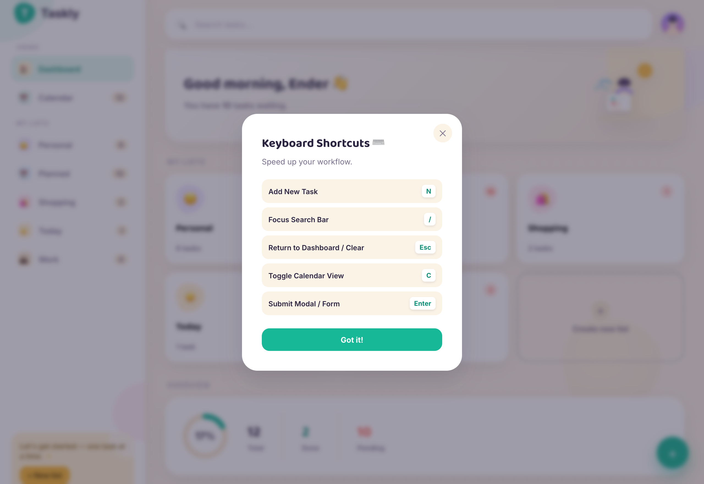
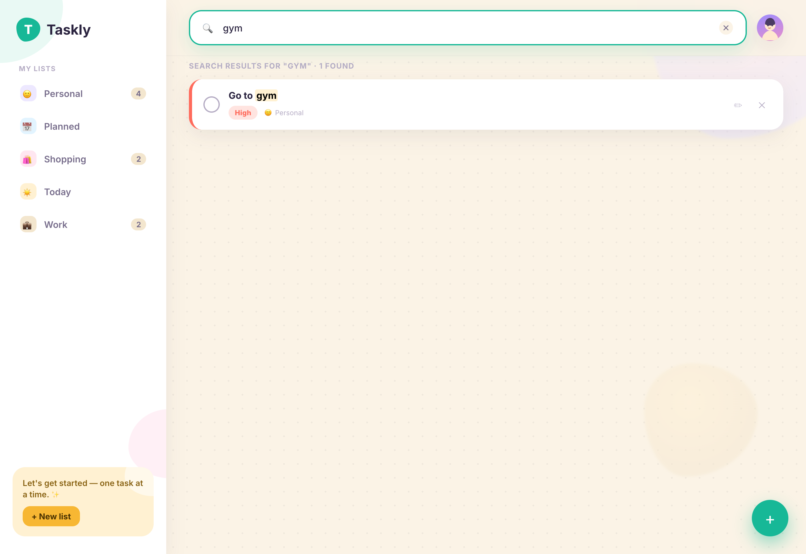

# ⚡ Taskly — Get Organized Your Life

<div align="center">


**Taskly** is a fast, full-featured task manager application featuring a **Signature Cream Pastel Design System** (`#FBF3E6`), custom organic blob graphics, live search, background notifications, and dual persistence (Flask REST API + `localStorage` fallback).

[Features](#-features) • [Quick Start](#-quick-start) • [Screenshots](#-screenshots) • [Architecture](#-architecture) • [API & CLI](#-api--cli-utilities)

</div>

---

## 🎨 Screenshots & Visual Tour

### 1. Main Dashboard & Completion Overview
> Clean hero greeting, focus percentage ring chart, interactive category cards, and overview statistics.


### 2. Category List View & Task Management
> Filter by active/completed tabs, set task priorities (High/Medium/Low), assign due dates, and add inline tasks.


### 3. Add & Edit Task Dialog
> Priority selectors with visual indicator pills and optional date picker.


### 4. Create Custom List Modal
> Create custom task categories with an interactive 20-emoji picker grid.


### 5. Interactive Profile Popover & Focus Score
> Quick profile popover with 5-day streak counter, focus score meter, account settings, and keyboard shortcut guide.


### 6. Keyboard Shortcuts Reference
> Power-user keyboard navigation for ultra-fast task management.


### 7. Instant Live Search
> Instant full-text search across all lists with highlighted matching terms.


---

## ✨ Features

- 🎨 **Signature Cream Pastel & Sleek Dark Mode**: Toggle seamlessly between signature **Cream Pastel** (`#FBF3E6`) and **Sleek Molded Dark Mode** (`#12101D`).
- 📱 **Mobile PWA & Native Packaging**: Install Taskly as a native-like app on **iOS (iPhone/iPad)** and **Android** with offline support (`manifest.json` & `sw.js`).
- 📅 **Interactive Calendar View & Selectors**: Monthly grid calendar with priority dots, day detail modal, and direct **Month** (Jan–Dec) & **Year** (2020–2035) dropdown selectors.
- ⚡ **Dual Persistence Layer**: Connects automatically to the **Python Flask REST API** on startup (`data/tasks.json`). If offline, seamlessly defaults to `localStorage`.
- ☁️ **1-Click Live Cloud Hosting (Render / Heroku)**: Built-in `render.yaml` Blueprint and `Procfile` for instant deployment on Render.com with `gunicorn`.
- 📊 **Interactive Focus Metrics**: Dynamic percentage progress ring, total/done/pending stats, and automated streak calculation.
- 📂 **Custom Categories**: Built-in lists (*Today*, *Planned*, *Personal*, *Work*, *Shopping*) plus custom list creator with an emoji picker.
- 🏷️ **Priority Strips & Due Dates**: Red (High), Amber (Medium), Teal (Low) priority strips and overdue date tracking.
- 🔍 **Live Search Engine**: Instant filtering across all tasks and categories with `<mark>` term highlighting.
- ⏰ **Background Notification Daemon**: Python process (`reminders.py`) checks tasks periodically and triggers desktop notifications for overdue items.
- 💾 **Data Export Suite**: CLI utility (`export.py`) and API endpoints for exporting tasks to JSON and CSV formats.
- ⌨️ **Keyboard Navigation**: Global hotkeys (`N` for new task, `C` for calendar, `/` to search, `Esc` to exit/return).

---

## 📱 Mobile App Installation (iOS & Android PWA)

Taskly is packaged as a **Progressive Web App (PWA)** for mobile installation:

###  iPhone / iPad (iOS Safari)
1. Open Taskly in Safari.
2. Tap the **Share** button at the bottom of the screen.
3. Scroll down and tap **"Add to Home Screen"**.
4. Taskly will launch in full-screen standalone mode with its custom icon!

### 🤖 Android (Chrome)
1. Open Taskly in Chrome.
2. Tap the **"Install Taskly"** prompt or open the Chrome menu (⋮) and select **"Install App"**.

---

## ☁️ Deploy Live on Render (1-Click Hosting)

Deploy Taskly to **Render.com** for free:

1. Push this repository to GitHub.
2. Log into [Render.com](https://render.com) and click **New + ➔ Blueprint**.
3. Connect your repository — Render will automatically detect `render.yaml` and configure the Python web service with `gunicorn server:app`!

---

## 🚀 Quick Start

### Prerequisites
- **Python 3.9+** installed on your system.

### Running Taskly

#### macOS & Linux
```bash
chmod +x run.sh
./run.sh
```

#### Windows
```cmd
run.bat
```

`run.sh` / `run.bat` automatically:
1. Installs Python dependencies (`flask`, `flask-cors`).
2. Starts the **Flask API Server** (`localhost:5050`).
3. Launches the **Background Reminder Daemon** (`reminders.py`).
4. Opens **Taskly** in your default web browser.

### Stopping Taskly
To stop all background Python services:
```bash
./stop.sh       # macOS / Linux
stop.bat        # Windows
```

---

## 🛠️ Project Structure

```text
taskly/
├── frontend/                 # Web Application Frontend
│   ├── index.html            # Semantic HTML5 App Shell & Modals
│   ├── style.css             # Cream Pastel Design Tokens & Layouts
│   └── app.js                # State Management & API Sync Engine
├── data/                     # Persistent JSON Storage & Logs
│   ├── tasks.json            # Active Task Database
│   └── .gitkeep
├── screenshots/              # High-Res Documentation Gallery
├── server.py                 # Flask REST API & Web File Server
├── reminders.py              # Background Reminder Daemon (Desktop Alerts)
├── export.py                 # CLI Export Utility (JSON & CSV)
├── take_screenshots.py       # Automated Playwright Screenshot Generator
├── run.sh / run.bat          # Cross-Platform Application Launchers
├── stop.sh / stop.bat        # Process Management Scripts
└── requirements.txt          # Python Dependencies
```

---

## 🔌 API & CLI Utilities

### Python REST API Endpoints

| Endpoint | Method | Description |
|---|---|---|
| `GET /api/health` | `GET` | Health check & mode indicator |
| `GET /api/data` | `GET` | Retrieve full JSON dataset (tasks + lists) |
| `POST /api/data` | `POST` | Atomically save updated dataset to disk |
| `GET /api/export/json` | `GET` | Download timestamped JSON task backup |
| `GET /api/export/csv` | `GET` | Download tasks formatted as CSV |
| `GET /api/overdue` | `GET` | Get JSON list of overdue pending tasks |

### CLI Utilities

#### Export Tasks to CSV / JSON
```bash
python3 export.py              # Export both JSON and CSV to exports/
python3 export.py --csv        # Export CSV only
python3 export.py --summary    # Print task summary stats in terminal
```

#### Generate Documentation Screenshots
```bash
python3 take_screenshots.py    # Generates crisp retina screenshots in screenshots/
```

---

## ⌨️ Keyboard Shortcuts

| Key | Action |
|---|---|
| <kbd>N</kbd> | Open **Add Task** modal (when viewing a list) |
| <kbd>/</kbd> | Focus the **Search Bar** |
| <kbd>Esc</kbd> | Return to **Dashboard** / Close active modal |
| <kbd>Enter</kbd> | Submit active modal or inline form |

---

## 📄 License
Distributed under the **MIT License**.
